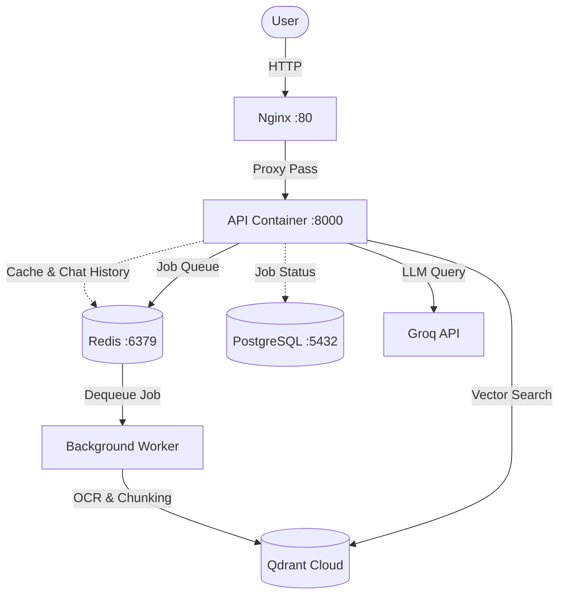

# Thought-Processor

> "A production-grade RAG backend that takes complex PDF manuals as input and asynchronously provisions highly-accurate, conversational AI answers."

## Architecture



## Results / Benchmarks

- "Context precision: 0.61 (naive PyPDF) ➔ 0.88 (Docling OCR + semantic chunking). Latency: ~350ms TTFT."

## Technical Decisions

1. **Redis Queue (rq) over Celery:** To avoid blocking the FastAPI server during document uploads, we introduced a background worker. We chose `rq` because it is Python-native, simple to configure, and allowed us to maximize our existing Redis container, which was already handling API caching and conversational history.
2. **Docling for OCR:** Automotive manuals are heavy with complex tables and images. Basic tools like PyPDF fail to preserve this structure. Using Docling required adding graphics libraries (`libGL`) to our Dockerfile, increasing the container size. We accepted this trade-off because it drastically improved vector precision and allowed the LLM to understand tabular technical specs.
3. **Immutable Deployment CD Pipeline:** In our GitHub Actions CD workflow, we deploy to our DigitalOcean droplet using `git fetch` and `git reset --hard origin/main`. This strict approach ensures the droplet exactly mirrors the repository, treating the server as an immutable target and eliminating manual branch divergence errors.

## Features

- **FastAPI Backend**: High-performance, asynchronous REST API.
- **Background Ingestion**: Non-blocking document processing utilizing Redis Queue (RQ). Documents are chunked (using LangChain) and OCR'd (using Docling) in a background worker.
- **Vector Search**: High-performance vector retrieval with **Qdrant**.
- **Conversational Memory**: Chat histories are stored and retrieved efficiently using **Redis**.
- **Job Tracking**: Persistent job status tracking (PENDING, PROCESSING, COMPLETED, FAILED) via **PostgreSQL**.
- **Idempotency & Retries**: Robust job failure handling with exponential backoff and retry mechanisms.
- **Caching**: Frequently asked questions are cached in Redis to lower latency and LLM costs.
- **Telemetry & Health Probes**: Includes structured logging, request IDs via middleware, and Kubernetes-style probes (`/health`, `ready`).
- **Containerized**: Fully orchestrated with **Docker Compose** for easy setup and reproducibility.

## Technology Stack

- **Framework**: FastAPI, Uvicorn
- **AI / ML**: LangChain, Docling (OCR & Parsing), HuggingFace (Embeddings), Groq (LLMs)
- **Databases & Stores**: Qdrant (Vector DB), PostgreSQL (RDBMS), Redis (Cache & Message Queue)
- **Infrastructure**: Docker, Docker Compose

## Getting Started

### Prerequisites

- [Docker](https://docs.docker.com/get-docker/)
- [Docker Compose](https://docs.docker.com/compose/install/)

### Installation & Execution

1. **Clone the repository and go to the project directory**
   ```bash
   cd /path/to/RAG
   ```

2. **Configure Environment Variables**
   Create a `.env` file based on `.env.example`:
   ```bash
   cp .env.example .env
   ```
   *Make sure to fill in your API keys (e.g., `GROQ_API_KEY`) and adjust other configuration variables as needed.*

3. **Start the Services**
   Use Docker Compose to build and start the API, background worker, Redis, and PostgreSQL containers:
   ```bash
   docker-compose up -d --build
   ```
   Wait a few moments for the database and containers to fully initialize.

## API Endpoints

### User Interface
- **`GET /`**: Serves a basic frontend UI for uploading files and querying the RAG system.

### Document Ingestion
- **`POST /upload`**
  Upload a PDF document. Returns a `job_id` and places the document in a processing queue.
- **`GET /job/{job_id}`**
  Check the status of your document ingestion job (e.g., `PENDING`, `PROCESSING`, `COMPLETED`, `FAILED`).

### Query
- **`POST /ask`**
  Ask questions based on the ingested documents.
  - **Body**: `{"question": "Your question here", "session_id": "optional-session-id"}`
  - Streams the answer back to the client using Server-Sent Events and keeps track of context/history per `session_id`.

### Telemetry & Infrastructure
- **`GET /health`**: Returns HTTP 200 `{"status": "ok"}` if the main API process is alive.
- **`GET /ready`**: Checks the connection of underlying services (Redis, PostgreSQL, Qdrant). Returns HTTP 200 only if all downstream dependencies are fully reachable.

## Project Structure

- `chatbot_fast.py` — The core FastAPI application, routes, and QA logic.
- `worker.py` — Background worker process for asynchronous OCR, chunking, and embedding.
- `database.py` & `models.py` — SQLAlchemy configuration and database schemas.
- `redis_client.py` — Helpers for Redis cache, job queue, and chat history.
- `config.py` — Centralized application configuration and dependency injection (LLMs, Vector stores).
- `docker-compose.yml` — Container orchestration for seamless deployment.

## Testing

A load testing script (`load_test.py`) is included to validate concurrent request handling and simulate various API request volumes.
